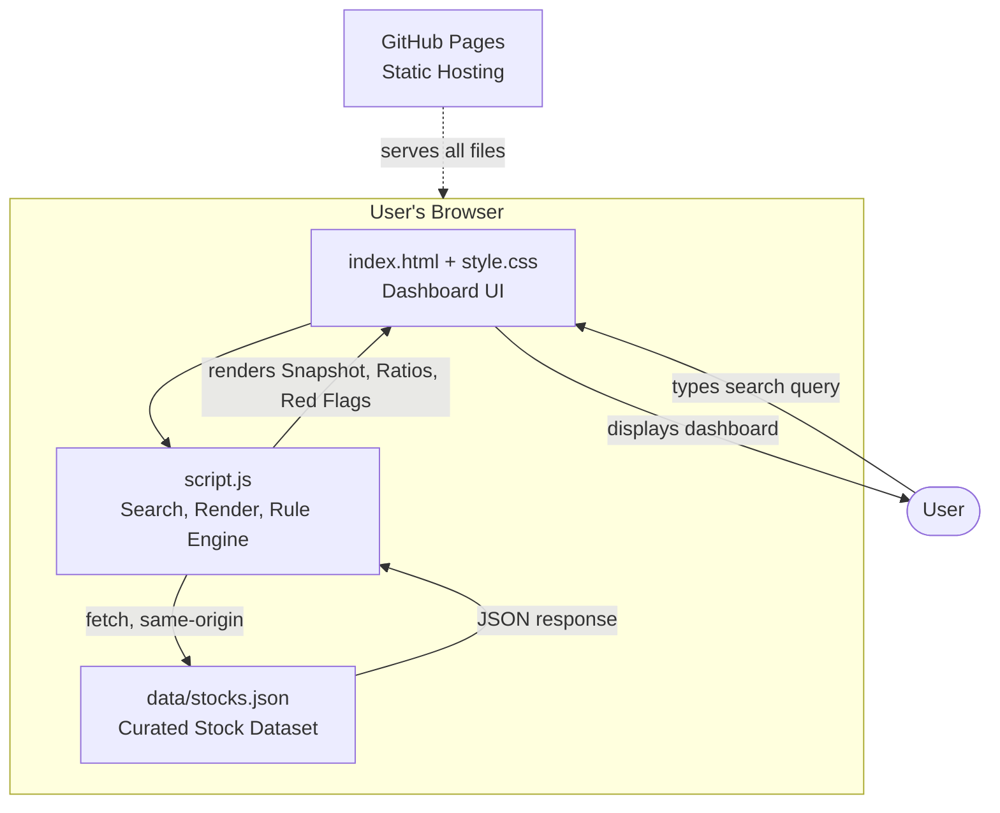
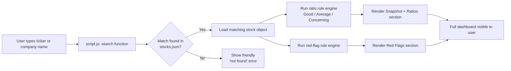
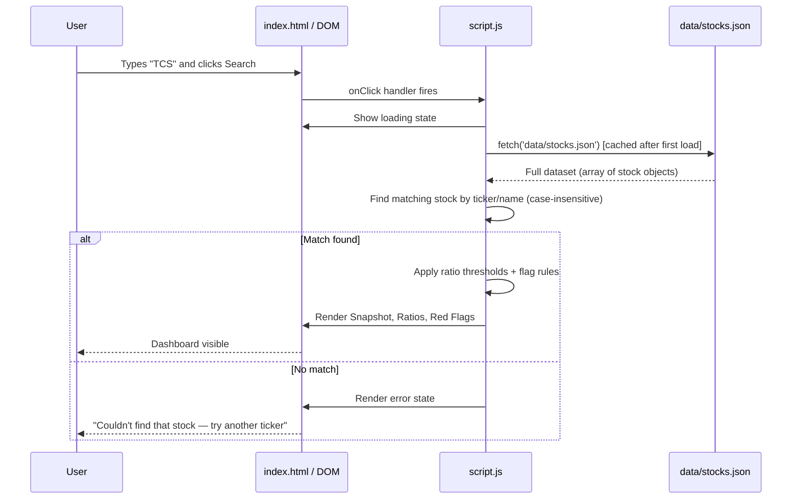

# ARCHITECTURE.md — StockSense

**Status:** Finalized Day 2. This is the source of truth for all technical decisions. Do not change without flagging why.

---

## 1. Key Day 2 Decision: Static Curated Data (No Live API, No Backend)

Research confirmed NSE/BSE have no official public API. Free third-party wrappers exist, but they require either a server-side API key (unsafe to expose in client-side code) or self-hosting a proxy server (which would add backend infrastructure we don't need).

**Decision:** v1.0 ships with a **curated static JSON dataset** of ~15–20 well-known NSE-listed companies, bundled directly into the site. This is now the *primary* data source, not a fallback — it removes the single biggest risk from the project, keeps the architecture genuinely simple, and guarantees the app works reliably in a live demo. Data freshness is handled honestly: every stock entry carries a `lastUpdated` date, shown to the user.

**Trade-off, stated plainly:** the app shows a fixed set of stocks with periodically-updated (not real-time) data. This is clearly disclosed in the UI and documented as a v1.0 limitation, with "connect a live data API" listed as future scope.

---

## 2. Tech Stack

| Layer | Choice | Why |
|---|---|---|
| **Frontend** | Plain HTML5, CSS3, vanilla JavaScript (ES6+) | No build step, no framework overhead — fastest path to a working, deployable product at a 1–2 hr/day pace. Matches the builder's existing comfort level (HTML/CSS/JS). |
| **Backend** | None | Not needed — all data is bundled static JSON, served as-is by GitHub Pages. |
| **Database** | None (flat JSON file: `data/stocks.json`) | A real database is unnecessary overhead for ~15–20 static records. JSON is queryable in-browser with plain JS. |
| **Authentication** | None | No user accounts in v1.0 (explicitly out of scope per PRD). |
| **AI Model / API** | None required for v1.0 | The "plain-English explanations" and "red flags" are rule-based (pre-written text + threshold logic), not AI-generated, so results are consistent, explainable, and free to run. Noted as a candidate area for future AI-generated summaries. |
| **Hosting** | GitHub Pages | Free, matches the builder's prior experience, zero config beyond a repo setting, perfect for a static site. |
| **Charting (stretch only)** | Chart.js via CDN | Lightweight, no install step, well-documented, only pulled in if the price-chart stretch goal is attempted. |
| **Dev tools** | VS Code + Live Server extension, Git/GitHub | Already installed; enables instant local preview without a build process. |

---

## 3. Component Diagram

There are no external network calls in v1.0. Everything the browser needs is delivered once, on page load / first fetch, from the same static site.

---

## 4. Data Flow

---

## 5. Request Lifecycle (Sequence Diagram)

---

## 6. AI Interaction

Not applicable for v1.0 — no AI model or API is called at runtime. This is intentional: rule-based, transparent logic is more trustworthy for a beginner-facing financial tool than an opaque AI judgment, and it has zero latency/cost. Noted in Future Scope (PRD §5.2/5.3, Pitch Deck) as a natural v2.0 direction (e.g., AI-generated plain-English summaries).

---

## 7. External Services

**None in v1.0.** The only "external" dependency is GitHub Pages itself (hosting) and, only if the price-chart stretch goal is attempted, the Chart.js CDN script. No API keys, no accounts, no billing risk.

---

## 8. Architecture Principles Carried Forward

- **Zero backend, zero cost.** Everything must run as static files.
- **Zero external runtime dependencies for the core (must-have) features.**
- **Graceful degradation.** Every fetch/search has an explicit error path — never a blank page or console-only failure.
- **Data honesty.** Every displayed stock shows when its data was last updated, so the tool never implies real-time accuracy it doesn't have.